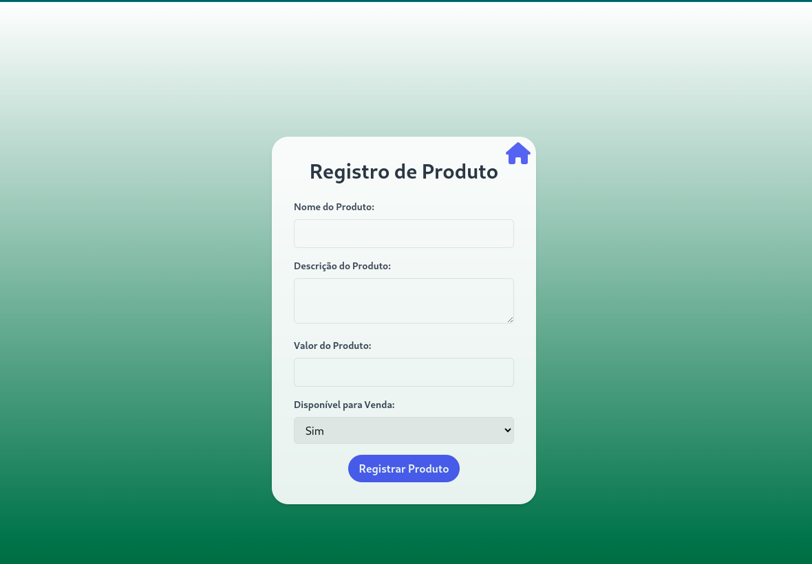
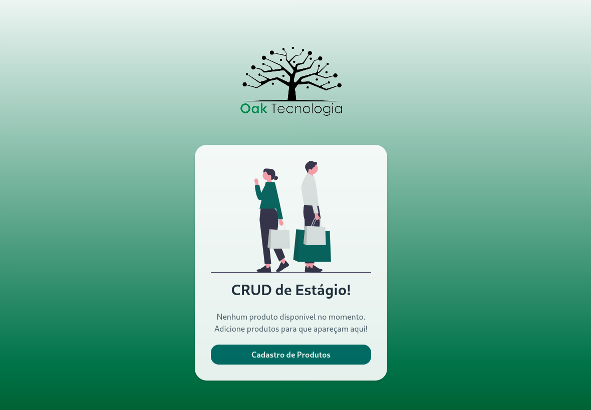

# CRUD de Produtos para Estágio

Este projeto é um aplicativo simples de CRUD (Create, Read, Update, Delete) para gestão de produtos, desenvolvido com **React**. Ele permite adicionar, visualizar, atualizar e excluir produtos, e foi construído para uma aplicação de estágio. O layout é minimalista e foca na funcionalidade essencial de gerenciamento de produtos.

## Funcionalidades

1. **Cadastro de Produtos**:
   - Formulário com os seguintes campos:
     - **Nome do Produto**: Campo de texto.
     - **Descrição do Produto**: Campo de texto.
     - **Valor do Produto**: Campo de valor numérico.
     - **Disponível para Venda**: Campo de seleção com duas opções: Sim / Não.

2. **Listagem de Produtos**:
   - Exibe uma lista de produtos com as colunas **Nome** e **Valor**.
   - Os produtos são ordenados pelo **Valor** do menor para o maior.
   - Após cadastrar um novo produto, a listagem é exibida automaticamente.
   - Existe um botão na listagem para **Cadastrar um Novo Produto**.

## Pré-requisitos

Para rodar o projeto localmente, você precisará ter o **Node.js** e o **npm** (Node Package Manager) instalados em sua máquina.

- [Node.js](https://nodejs.org/)
- [npm](https://www.npmjs.com/)

## Como rodar o projeto

npm install  (para instalar todas as dependências do projeto)
e npm run dev (para rodar o projeto), ceritifique-se de ter o tailwind instalado também!
